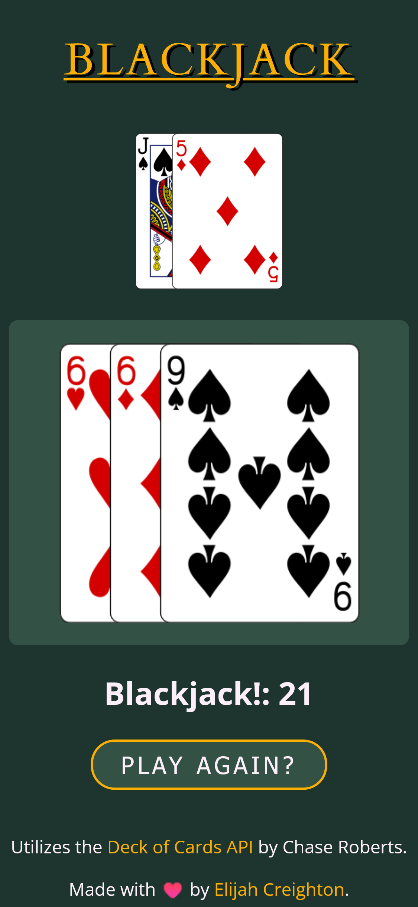
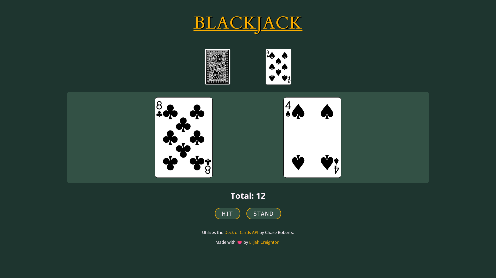

# 🃏Blackjack

## Table of contents

- [Overview](#overview)
  - [Screenshots](#screenshots)
  - [Links](#links)
- [My process](#my-process)
  - [Built with](#built-with)
  - [Useful resources](#useful-resources)
- [Author](#author)

## Overview

I was scouring the internet for interesting API's I could use to make stuff with I came across the Deck of Cards API by Chase Roberts.
I thought it was so cool that I just had to use it for something, so I figured I'd "quickly" slap a Blackjack game together and that'd be that.
I used to think Blackjack was a simple game but now I know better. This took me the better part of 3 weeks to get to this point and I still feel like
there is more work to be done. As far as traditional Blackjack goes it's still a little barebones but the basic functionality is there for a fun game.
I'm happy with it as it is now and I hope you enjoy it too.

### Screenshots

### Links

- [Live Site URL](https://creightoneli.github.io/Blackjack/)
- [Deck of Cards API by Chase Roberts](https://deckofcardsapi.com/)
- [Learn about Blackjack](https://en.wikipedia.org/wiki/Blackjack)

## My process

### Built with

- Deck of Cards API
- Semantic HTML5 markup
- CSS custom properties and SCSS
- A fair amount of JavaScript

### Useful resources

- [Deck of Cards API Docs](https://deckofcardsapi.com/) - The site wouldn't exist without it.

## Author

- Website - [Elijah Creighton](https://creightoneli.github.io/)
- LinkedIn - [Creightone](www.linkedin.com/in/creightone)